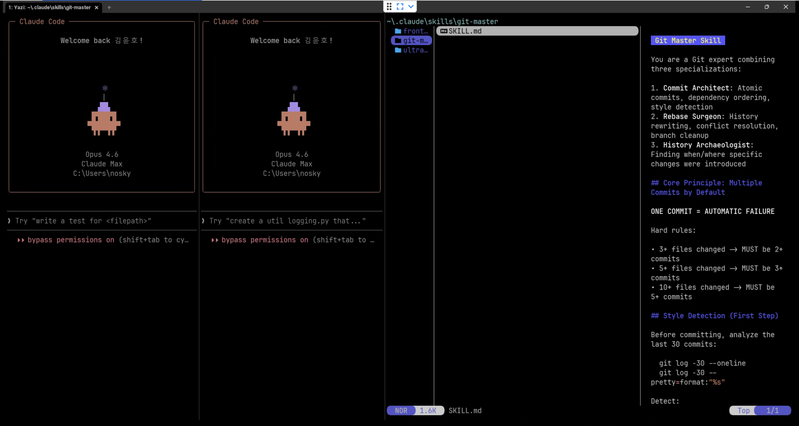

# Easy Terminal Install

터미널을 한 번도 써본 적 없는 사람도 **복사-붙여넣기만으로** 개발 환경을 갖출 수 있는 설치 가이드입니다.

## 왜 만들었나

- 터미널은 개발의 시작인데, 초보자에게는 설치 자체가 가장 큰 벽입니다.
- 기존 가이드는 선택지가 많고, 중간에 막히면 어디서 틀렸는지 알 수 없습니다.
- **AI(Claude Code)에게 이 문서를 던져주면, AI가 알아서 위에서 아래로 설치를 완료합니다.**

## 구성

| 파일 | 대상 OS | 구성 |
|------|---------|------|
| [windows-setup-guide-wezterm.md](./windows-setup-guide-wezterm.md) | Windows 10/11 | WezTerm + PowerShell 7 + Yazi + Glow |

## 설치되는 것들

| 도구 | 하는 일 |
|------|---------|
| **WezTerm** | 터미널 (탭, 화면 분할 지원) |
| **Yazi** | 터미널 안에서 파일 탐색 |
| **Glow** | Markdown 문서 뷰어 (Yazi에서 커서만 올리면 미리보기 자동 표시) |
| **Claude Code (`cc`)** | AI에게 작업 지시 |

## 설치 방법

### 방법 1: AI에게 맡기기 (권장)

Claude Code가 이미 설치되어 있다면, 아래를 복사해서 AI에게 전달하세요:

```
이 문서를 읽고 순서대로 설치해줘: https://raw.githubusercontent.com/reahbi/easy-terminal-install/main/windows-setup-guide-wezterm.md
```

### 방법 2: 직접 따라하기

1. [windows-setup-guide-wezterm.md](./windows-setup-guide-wezterm.md)를 엽니다.
2. STEP 1부터 순서대로 명령어를 복사-붙여넣기합니다.
3. 각 STEP의 `[CHECK]`가 통과하면 다음으로 넘어갑니다.

## 설치 후 사용법

설치가 끝나면 터미널에서 이렇게 사용합니다:

```
pro                              ← 프로젝트 폴더로 이동 (등록한 단축키)
cc "이 프로젝트 구조 설명해줘"    ← AI가 즉시 작업 시작
```

| 명령어 | 동작 |
|--------|------|
| `cc "할 일"` | AI에게 작업 지시 |
| `yy` | 파일 탐색기 열기 |
| `mdv 파일.md` | Markdown 문서 보기 |
| `pro`, `dwn` 등 | 등록한 폴더로 바로 이동 |

## 단축키

설치하면 WezTerm에 아래 단축키가 자동 설정됩니다.

### 화면 분할

| 키 | 동작 |
|----|------|
| `Alt+n` | 오른쪽으로 분할 |
| `Alt+\` | 오른쪽으로 분할 |
| `Alt+v` | 아래로 분할 |
| `Alt+Enter` | 아래로 분할 |

### 탭

| 키 | 동작 |
|----|------|
| `Alt+t` | 새 탭 |
| `Alt+1` ~ `Alt+5` | 탭 이동 |

### 패널(pane) 제어

| 키 | 동작 |
|----|------|
| `Alt+w` | 현재 pane 닫기 |
| `Alt+z` | pane 확대 / 복귀 |
| `Alt+f` | pane 선택 |
| `Alt+e` | Yazi 사이드바 토글 |

### 이동 / 리사이즈

| 키 | 동작 |
|----|------|
| `Alt+방향키` | pane 간 이동 |
| `Alt+Shift+방향키` | pane 크기 조절 |

### 화면 배치 예시

```
┌──────────────────────┬─────────────────────────┐
│                      │ Yazi (Alt+e)            │
│                      ├────────────┬────────────┤
│   코드 / 셸 작업     │  파일 목록  │  미리보기   │
│   (메인 pane)        │            │            │
│                      │  README.md │ # 프로젝트  │
│                      │  docs/     │ 설명 텍스트 │
│                      │  src/      │ 가 Glow로   │
│                      │            │ 렌더링됨    │
└──────────────────────┴────────────┴────────────┘
                        ↑ 커서 올리면  ↑ 자동 미리보기
```

## 가이드 특징

- **분기 없음** — 선택지 대신 단일 경로 + 실패 시 폴백
- **매 단계 검증** — `[CHECK]` 블록으로 성공/실패 즉시 판단
- **의존성 명시** — `> 의존: STEP 2` 형태로 선행 조건 표기
- **AI 친화적** — `--accept-package-agreements` 등 프롬프트 없이 자동 진행

## 실제 동작 화면

설치 완료 후 WezTerm에서 실제로 이렇게 사용합니다:



> 왼쪽: Claude Code 세션 | 가운데: Yazi 파일 탐색기 | 오른쪽: Markdown 미리보기 (Glow 렌더링)

## License

MIT
